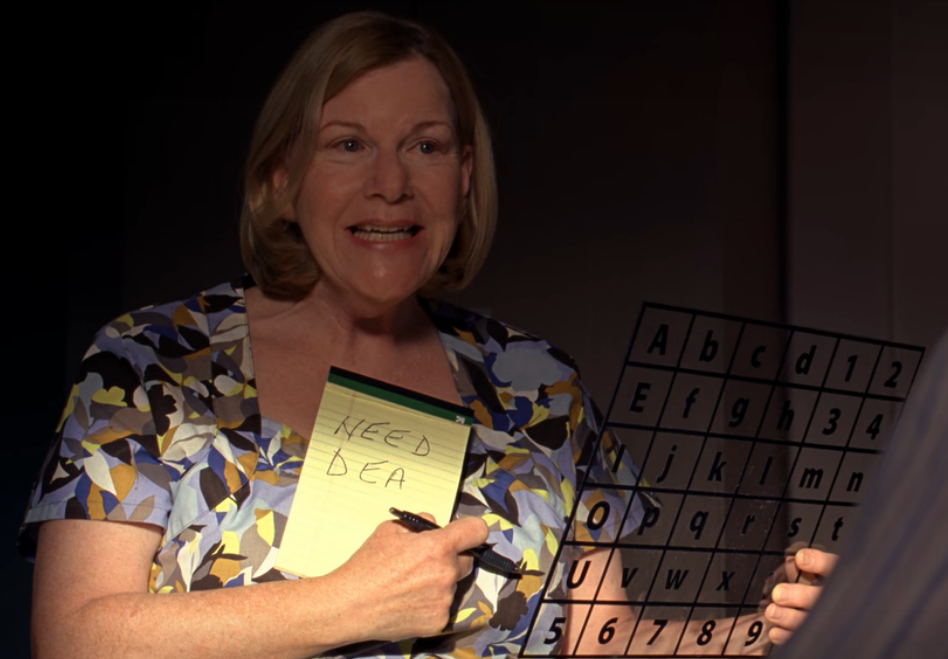

# What if Hector Salamanca knew CS algorithms?

A curious look at how Breaking Bad's Hector Salamanca could have communicated more efficiently. To come: a short article showing how this interesting constraint led to thoughts of potential approaches to making communication for those who have difficulty communicating easier.

I don't own anything pertaining to Breaking Bad.
